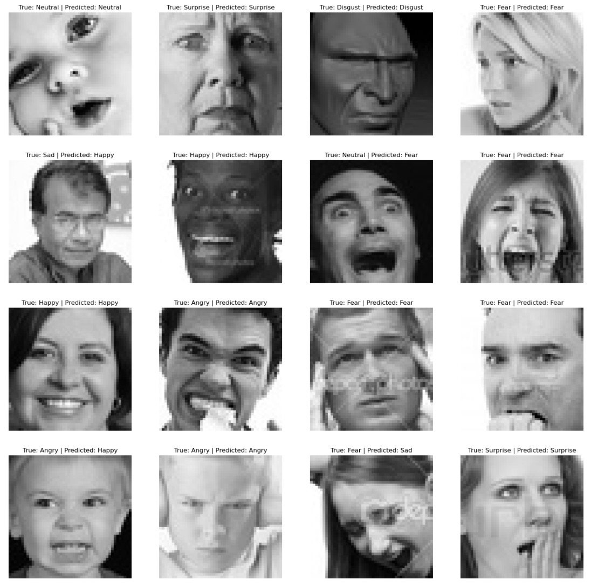
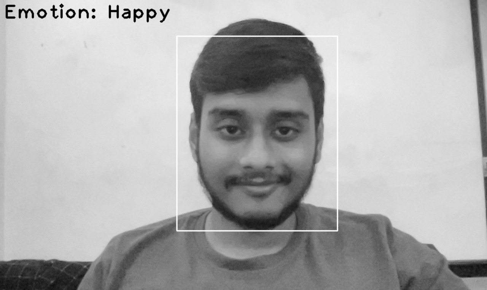
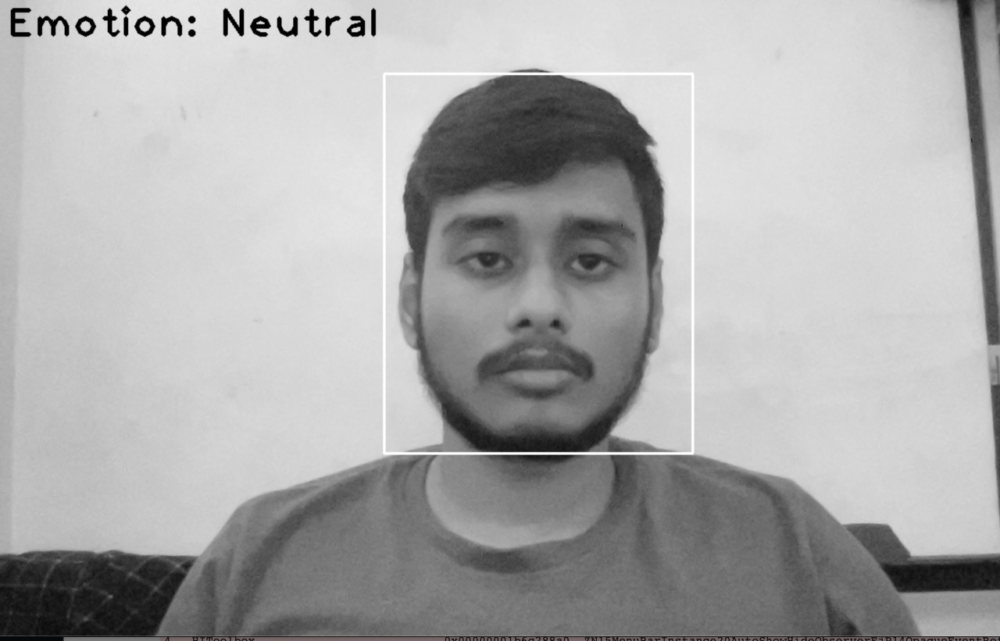

# Facial_Emotion_Detector

Facial Emotion detector coded from scratch using PyTorch and OpenCV.

## Emotion Detector:
- Data: Facial expression [dataset](http://www.kaggle.com/dataset/de270025c781ba47a3a6d774a0d670452bfb4dc9d2d6b13740cdb0c17aa7bf2b) from Kaggle.
- Classifiers:
    - Custom ResNet-18 implementation
    - Tranfer Learning: Pre-trained ResNet-18 on subset of ImageNet Dataset
- Realtime Rendering (from WebCam):
    - Preprocessing: OpenCV
    - Frame Facial Detector: Haar Cascade Frontal Face Detector

Results on the Test Data:

Sample Realtime Detection off WebCam:

